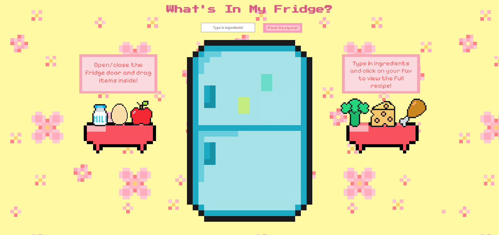
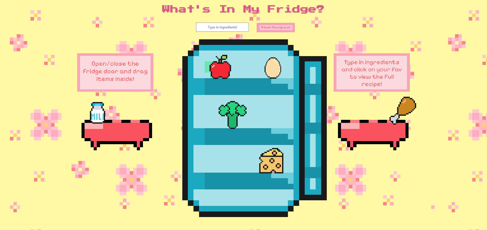

# What's In My Fridge?

A playful full stack web app that helps you find recipes based on the ingredients you have at home. Drag and drop pixel-art food items into your virtual fridge, or type in your own ingredients and discover delicious recipes powered by Spoonacular API!

## Features

- Interactive UI: Drag and drop food items into a pixel-art fridge.
- Recipe Finder: Enter ingredients and get real recipes you can make.
- Fun Design: Retro pixel-art visuals and playful animations.
- Full Stack: Built with vanilla JS, HTML/CSS (frontend) and Node.js/Express (backend).
- Real API Integration: Fetches recipes from the Spoonacular API.

## Demo Screenshots

### 1. Closed Fridge (Start Screen)



### 2. Fridge Open with Ingredients Inside



### 3. Recipe Results Popup


## 🛠️ Tech Stack

🛠️ Tech Stack

- Frontend: HTML, CSS, JavaScript
- Backend: Node.js, Express
- API: Spoonacular

## 🚀 How to Run

```bash
# Clone the repo
git clone  https://github.com/aimanahmedd/whats-in-my-fridge.git
cd yourrepo

# Open in browser
open index.html
```
